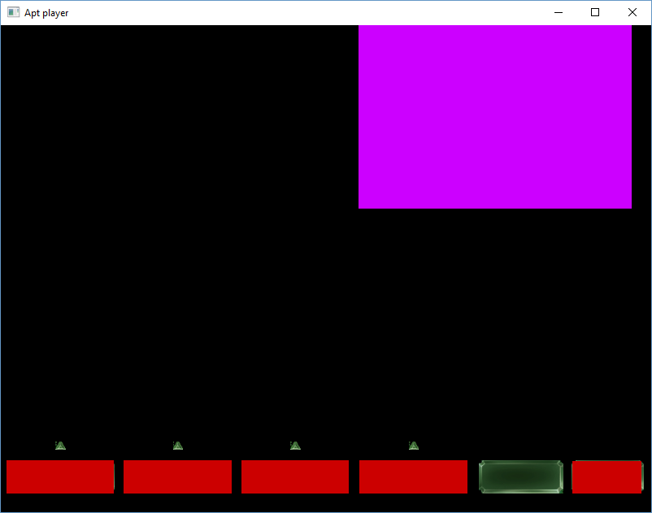

# Purpose of this project
This project is aimed at decoding & rendering .apt files that are used by the SAGE engine from EA Games. 
The .apt file format is heavily based on SWF files (adobe flash). There are a couple differences though, most noticeably in the actionscript bytecode.
EA Games did expand this with their own custom Bytecodes, see the bytecode.hpp for reference

# Build status

# Format specificaiton
Most of the information i got about this format was found in the modding tools "apt2xml" and
"xml2apt" that were released by Jonwil on his homepage http://www.cncmods.net ,which is currently
offline unfortunaly.

The format is also heavily based on SWF v9. See the specification of that format here:
[specification](docs/swf_file_format_spec_v9.pdf)

# Current status
The parsing works pretty well, but the actionscript part needs much more work. 
Below I'll add screenshots on how the file should look and how it is looking at the moment.
Battle for Middleearth II:

The apt player using libapt:

Notice that the background is not actually part of the Apt file.
Most differences are due to missing actionscript support. Text support is on my TODO
list aswell.